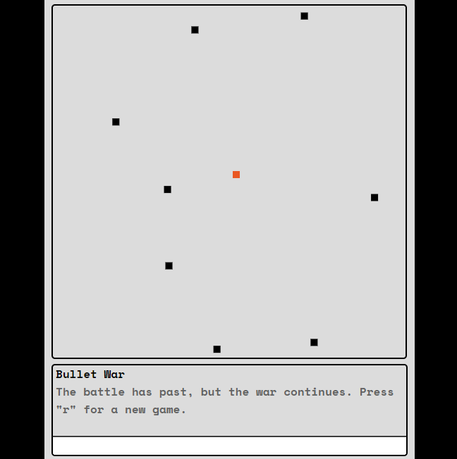

# BulletWar

A bullet hell game inspired by <i>spacewar!</i> Play against your friends and try to outlast them by shooting and dodging bullets. Built with html, css, javascript, and socket.io.

# How To Play

1. You can play the game solo or with friends. You first start a game by entering your name in the game title. A new game will start when a second player joins the game.

   

2. Shoot bullets with the left mouse button and dodge using WASD keys. Each player has 3 lives with 3 HP for each life. Once all 3 lives are depleted, that player is out of the game and is sent to the shadow realm.

   

3. The last living player is the winner. You can play again by pressing the "r" key after the game over message. This will start a new game for all players.

   

# References

- [ScriptersWar's Multiplayer Nodejs Tutorial](https://scripterswar.com/tutorial/nodejs#)

- [ScriptersWar's HTML5 Game Tutorial](https://scripterswar.com/tutorial/html5)
